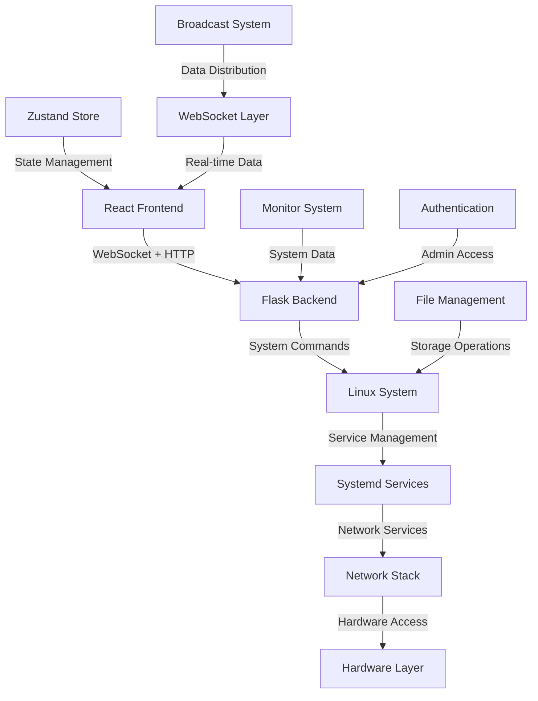

# HOMESERVER - Professional Digital Sovereignty Platform

HOMESERVER is a professional-grade digital sovereignty platform - a "datacenter in a box" that provides complete independence from Big Tech surveillance. This is NOT a consumer appliance, but rather enterprise-grade infrastructure that happens to fit in your house.

## System Architecture Overview

The HOMESERVER platform consists of several integrated components working together to provide a comprehensive digital sovereignty solution:

## Core Components

### 1. Flask Backend (`backend/`)

The backend provides the core API and WebSocket functionality:

- **Application Factory** (`__init__.py`): Creates and configures the Flask app with dynamic configuration loading
- **WebSocket Layer** (`sockets/`): Manages real-time bidirectional communication with rate limiting and authentication
- **Broadcast System** (`broadcasts/`): Distributes real-time data to connected clients with admin filtering
- **Monitor System** (`monitors/`): Collects system information (CPU, memory, disk, services, network)
- **Authentication** (`auth/`): PIN-based admin authentication with session management
- **Blueprint Modules**: Modular organization for different functionality areas

#### Key Backend Features:
- **Real-time Monitoring**: System stats, service status, power consumption, network connectivity
- **Admin Controls**: Disk management, system control, service management, updates
- **File Operations**: Upload, download, directory browsing, NAS integration
- **Security**: Rate limiting, connection management, admin filtering, CORS protection

### 2. React Frontend (`src/`)

The frontend provides a sophisticated tablet-based UI system:

- **App Component** (`App.tsx`): Main orchestrator with vault authentication and bootstrap initialization
- **State Management** (`store/`): Zustand-based store with 14 specialized slices
- **WebSocket Integration**: Real-time data subscription and admin authentication
- **Tablet System**: Dynamic module loading for different service interfaces
- **Fallback System**: Robust error recovery and graceful degradation

#### Key Frontend Features:
- **Multi-phase Startup**: Vault authentication → Bootstrap → Core initialization → WebSocket → App ready
- **Admin Mode**: PIN-based authentication with session timeout and activity tracking
- **Real-time Updates**: Live system monitoring, service status, power consumption
- **File Management**: Hierarchical browsing, upload/download, NAS integration
- **Theme System**: Dynamic theming with CSS variable injection
- **Error Recovery**: Comprehensive fallback system with alternative tab loading

### 3. State Management (`src/store/`)

The Zustand store provides sophisticated state management:

#### Store Slices:
- **Admin Management**: Authentication, session management, PIN validation
- **Theme System**: Dynamic theming with CSS variable injection
- **Visibility Control**: Tab and element visibility with debounced updates
- **Tab Management**: Active tabs, starred tabs, tab configurations
- **WebSocket Communication**: Real-time connection and event handling
- **Directory Management**: File system navigation with caching
- **Subscription System**: WebSocket event subscriptions with type safety
- **Fallback Mode**: Error recovery and fallback state management
- **Broadcast Data**: WebSocket data storage with admin/regular modes
- **API Caching**: Request caching with expiration and admin-aware clearing
- **Sync Operations**: File synchronization with progress tracking
- **Inactivity Timeout**: Session timeout management
- **Startup Management**: Application initialization and phase tracking

### 4. WebSocket Communication

Real-time bidirectional communication between frontend and backend:

#### Data Flow:
1. **Monitor Classes** collect system data at configurable intervals
2. **Broadcast Manager** registers data streams and manages subscriptions
3. **Comparison Functions** determine when data has meaningfully changed
4. **WebSocket Handlers** route events to appropriate subscribers
5. **Frontend Hooks** subscribe to data streams and update UI

#### Broadcast Types:
- **Regular Broadcasts**: System stats, service status, power consumption, network status
- **Admin-Only Broadcasts**: Detailed system information, comprehensive disk data
- **Mixed Broadcasts**: Regular data with additional admin-only fields

### 5. Configuration Management

Dynamic configuration system with multiple layers:

#### Configuration Sources:
- **Environment Variables**: Development/production settings
- **JSON Configuration**: `/var/www/homeserver/src/config/homeserver.json`
- **Dynamic Secrets**: Fresh encryption keys generated on each startup
- **Service Configuration**: Individual service settings and states

#### Configuration Features:
- **Live Updates**: Configuration changes without restart
- **Admin Settings**: PIN management, CORS origins, service configurations
- **Theme Configuration**: Dynamic theme loading and validation
- **Service States**: Active/inactive service tracking

## System Integration

### 1. Service Management

The platform integrates with 14+ enterprise services:

#### Web Services:
- **nginx**: Reverse proxy and web server
- **flask**: Main web interface
- **mkdocs**: Documentation system
- **gogs**: Git repository management
- **ttyd**: Terminal access

#### Media Services:
- **jellyfin**: Media server
- **navidrome**: Music streaming
- **piwigo**: Photo gallery

#### File Management:
- **calibreweb**: E-book management
- **filebrowser**: Web-based file manager
- **samba**: Network file sharing

#### Utilities:
- **postgresql**: Database server
- **freshrss**: RSS feed reader
- **tailscale**: VPN networking
- **transmission**: BitTorrent client
- **vaultwarden**: Password management

### 2. Network Infrastructure

Complete network control and monitoring:

#### Network Components:
- **nftables**: Advanced firewall with ad blocking
- **kea**: DHCP server for network management
- **unbound**: DNS server with ad blocking
- **Tailscale**: VPN for secure remote access
- **Transmission**: Torrent client with VPN integration

#### Network Monitoring:
- **Internet Connectivity**: Real-time status and speed testing
- **VPN Status**: Connection monitoring and configuration
- **Service Health**: Systemd service status and health checks
- **Network Interfaces**: Interface status and configuration

### 3. Hardware Monitoring

Comprehensive hardware monitoring and management:

#### Monitoring Capabilities:
- **CPU Usage**: Real-time CPU utilization and temperature
- **Memory Usage**: RAM usage and swap monitoring
- **Disk Health**: disk testing, NAS sync status
- **Power Consumption**: RAPL-based power monitoring
- **Process Monitoring**: System process tracking and management

#### Hardware Integration:
- **RAPL Monitoring**: Intel power consumption tracking
- **Disk Testing**: Automated drive health testing
- **NAS Integration**: Mount point monitoring and sync operations
- **Temperature Monitoring**: CPU and system temperature tracking

## Security Architecture

### 1. Authentication System

Multi-layered authentication and authorization:

#### Admin Authentication:
- **PIN-Based**: Admin PIN from configuration file
- **Challenge-Response**: WebSocket authentication protocol
- **Session Management**: Automatic timeout with activity tracking
- **Access Control**: Admin-only endpoints and data filtering

#### Security Features:
- **Rate Limiting**: Maximum connections per IP address
- **Heartbeat Monitoring**: Zombie connection detection and cleanup
- **CORS Protection**: Configurable cross-origin request handling
- **Input Validation**: All inputs validated and sanitized

### 2. Data Protection

Comprehensive data security measures:

#### Admin Filtering:
- **Field-Level Access**: Sensitive data only sent to authenticated admins
- **Data Sanitization**: Automatic removal of sensitive information
- **Session Isolation**: Separate data streams for admin and regular users
- **Audit Logging**: Security event tracking and monitoring

#### Encryption:
- **Dynamic Keys**: Fresh encryption keys generated on each startup
- **Secure Storage**: Encrypted configuration and sensitive data
- **Transport Security**: WebSocket encryption and secure communication

## Performance Optimizations

### 1. Frontend Optimizations

Advanced React performance techniques:

#### Performance Features:
- **Module Caching**: Prevents redundant tablet module loads
- **Debounced Updates**: Prevents excessive API calls during rapid changes
- **Image Pre-caching**: Loads images during bootstrap for faster rendering
- **Selective Re-renders**: Uses Zustand selectors for targeted updates
- **Memory Management**: Proper cleanup and garbage collection

#### Caching Strategy:
- **API Response Caching**: Configurable cache duration with expiration
- **Directory Caching**: Hierarchical file system caching
- **Theme Caching**: Dynamic theme loading with validation
- **State Persistence**: Selective localStorage persistence

### 2. Backend Optimizations

Efficient server-side performance:

#### Async Operations:
- **Eventlet**: Non-blocking I/O for WebSocket operations
- **Background Tasks**: Monitor data collection runs in background
- **Connection Pooling**: Efficient WebSocket connection management
- **Resource Monitoring**: Memory and process monitoring

#### Data Management:
- **Change Detection**: Only broadcasts when data meaningfully changes
- **Subscription Management**: Efficient client subscription tracking
- **Error Recovery**: Graceful handling of monitor failures
- **Resource Cleanup**: Automatic cleanup of stale connections

## Error Handling and Recovery

### 1. Frontend Error Recovery

Comprehensive error handling and fallback systems:

#### Fallback System:
- **Automatic Activation**: Triggers on connection loss, loading failures, or timeouts
- **Recovery Detection**: Monitors for conditions that allow normal operation to resume
- **Alternative Tab Loading**: Attempts to load alternative tablets before falling back
- **Graceful Degradation**: Shows helpful error messages and retry options

#### Error Types:
- **Loading Timeouts**: 15-second timeout with graceful degradation
- **Connection Issues**: WebSocket disconnect detection and recovery
- **Module Failures**: Fallback to alternative tablets or error UI
- **Factory Mode Errors**: Special handling for configuration issues

### 2. Backend Error Handling

Robust server-side error management:

#### Error Recovery:
- **Monitor Failures**: Individual monitor failures don't crash the system
- **Connection Loss**: Automatic reconnection handling
- **Data Errors**: Fallback values when data collection fails
- **Authentication Failures**: Clear error messages without information leakage

#### Logging System:
- **Structured Logging**: Consistent log format across all modules
- **Error Tracking**: Detailed error information for debugging
- **Performance Monitoring**: Logs for performance analysis
- **Security Events**: Logs for security monitoring

## Development and Deployment

### 1. Development Environment

Comprehensive development tooling:

#### Development Features:
- **TypeScript**: Full type safety throughout the application
- **ESLint/Prettier**: Code formatting and linting
- **Hot Reloading**: Development server with automatic reloading
- **Debug Tools**: Comprehensive debugging and logging
- **Testing Framework**: Unit and integration testing

#### Development Workflow:
- **Local Development**: React development server with hot reloading
- **Backend Development**: Flask development server with debugging
- **WebSocket Testing**: Real-time communication testing
- **State Management**: Zustand store debugging and inspection

### 2. Production Deployment

Professional-grade deployment system:

#### Deployment Components:
- **Gunicorn**: WSGI server for production deployment
- **Systemd Service**: Automatic startup and management
- **Log Rotation**: Automatic log file management
- **Health Monitoring**: System health and performance monitoring

#### Deployment Process:
- **Build Process**: React build with optimization
- **Service Management**: Systemd service configuration
- **Configuration Management**: Dynamic configuration loading
- **Health Checks**: Service validation and monitoring

## System Requirements

### Hardware Requirements:
- **CPU**: Intel processor with RAPL support for power monitoring
- **RAM**: Minimum 4GB, recommended 8GB+
- **Storage**: SSD for system, additional storage for media and data
- **Network**: Gigabit Ethernet for optimal performance

### Software Requirements:
- **Operating System**: Linux (Ubuntu/Debian recommended)
- **Python**: 3.8+ with required packages
- **Node.js**: 16+ for React development and build
- **Systemd**: For service management
- **Network Tools**: Standard Linux networking utilities

## Conclusion

HOMESERVER represents a complete digital sovereignty solution that provides professional-grade infrastructure in a home environment. The sophisticated architecture combines real-time monitoring, secure administration, comprehensive service management, and robust error recovery to create a platform that truly puts users in control of their digital lives.

