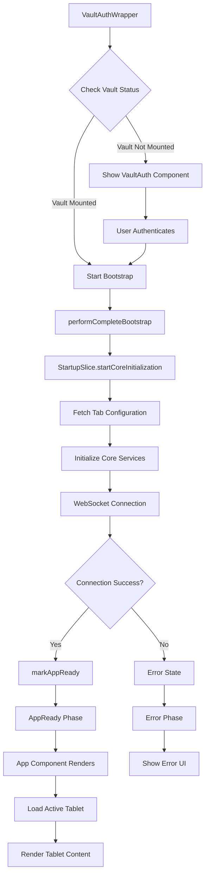

# App Component Overview

The `App` component is the main entry point and orchestrator for the tablet-based UI system. It operates within a sophisticated startup architecture that includes vault authentication, bootstrap initialization, and state management through Zustand.

## Architecture Overview

The application follows a layered initialization pattern:

1. **VaultAuthWrapper** (index.tsx) - Handles vault authentication and initial bootstrap
2. **App Component** - Manages tablet loading, fallback systems, and UI rendering
3. **Startup Slice** - Coordinates the multi-phase startup process
4. **Bootstrap System** - Handles core initialization and data fetching

## Startup Flow

The application startup follows a precise multi-phase sequence:



## Startup Phases

The application progresses through these phases:

- **Idle** - Initial state, waiting to begin
- **CoreInitializing** - Loading tab configuration and core services
- **CoreInitialized** - Core services ready, preparing WebSocket
- **WebSocketConnecting** - Establishing WebSocket connection
- **WebSocketConnected** - WebSocket established, finalizing
- **AppReady** - Application fully initialized and ready
- **Error** - Error state, showing error UI

## Vault Authentication

Before the main application starts, the `VaultAuthWrapper` component:

1. Checks if the vault is mounted via API call
2. If not mounted, shows the `VaultAuth` component for user authentication
3. Once authenticated, initiates the bootstrap process
4. Handles critical failures by redirecting to standalone fallback

## Bootstrap Process

The bootstrap process (`performCompleteBootstrap`) handles:

- **Image Caching** - Pre-loads images for better performance
- **Fallback Recovery** - Detects and handles recovery from previous fallback states
- **Core Initialization** - Fetches tab configuration and initializes core services
- **WebSocket Setup** - Establishes real-time communication
- **State Initialization** - Sets up the application state store

## App Component Responsibilities

The `App` component manages:

### State Management
- **Startup Phase Monitoring** - Tracks the current startup phase
- **Active Tab Management** - Handles tab switching and tablet loading
- **Fallback System** - Manages error states and recovery
- **Admin Session** - Handles admin mode and session timeouts

### Tablet Loading
The component uses a sophisticated tablet loading system:

1. **Module Caching** - Caches loaded tablet modules for performance
2. **Dynamic Imports** - Loads tablet modules on-demand
3. **Fallback Chain** - Attempts alternative tabs if primary fails
4. **Timeout Handling** - 15-second timeout with graceful degradation
5. **Recovery Logic** - Handles recovery from fallback mode

### Error Handling
- **Loading Timeouts** - Graceful handling of slow tablet loads
- **Connection Issues** - WebSocket disconnect detection and recovery
- **Module Failures** - Fallback to alternative tablets or error UI
- **Factory Mode Errors** - Special handling for configuration issues

## Tablet Module System

Tablet modules are loaded dynamically based on the active tab:

```typescript
// Module loading with caching and fallback
const loadTabletModule = async (tabId: string): Promise<any> => {
  // Normalize tab ID and handle special cases
  const normalizedTabId = tabId.startsWith('@') ? tabId.substring(1) : tabId;
  
  // Check cache first
  if (moduleCache.has(normalizedTabId)) {
    return moduleCache.get(normalizedTabId);
  }
  
  // Dynamic import with error handling
  try {
    const module = await import(`./tablets/${normalizedTabId}/index`);
    moduleCache.set(normalizedTabId, module);
    return module;
  } catch (error) {
    // Fallback chain execution
    const alternativeTabId = fallbackManager.executeFallbackChain();
    // ... fallback logic
  }
};
```

## Fallback System

The fallback system provides robust error recovery:

- **Automatic Activation** - Triggers on connection loss, loading failures, or timeouts
- **Recovery Detection** - Monitors for conditions that allow normal operation to resume
- **Alternative Tab Loading** - Attempts to load alternative tablets before falling back
- **Graceful Degradation** - Shows helpful error messages and retry options

## WebSocket Management

The component manages WebSocket connections for real-time updates:

- **Connection Monitoring** - Tracks connection status and handles disconnects
- **Activity Tracking** - Prevents session timeouts through user activity monitoring
- **Reconnection Logic** - Handles automatic reconnection attempts
- **Tab Synchronization** - Updates the server with the currently active tab

## Performance Optimizations

The application includes several performance optimizations:

- **Module Caching** - Prevents redundant tablet module loads
- **Debounced Loading** - Prevents rapid tab switching from causing excessive loads
- **Image Pre-caching** - Loads images during bootstrap for faster rendering
- **Benchmarking** - Performance measurement for optimization (when enabled)
- **Selective Re-renders** - Uses Zustand selectors for targeted updates

## User Activity Tracking

To prevent session timeouts, the component tracks:

- **Mouse Clicks** - Excludes form controls to avoid interference
- **Scroll Events** - Passive event listeners for performance
- **Touch Events** - Mobile interaction tracking
- **Activity Updates** - Regular server pings to maintain session

## Rendering States

The component conditionally renders based on startup phase:

- **Loading States** - Shows spinners during initialization phases
- **Error States** - Displays error messages with retry options
- **Fallback UI** - Special interface for error recovery
- **Normal Operation** - Full application interface with tablet content

## Development Features

In development mode, the component includes:

- **Debug Subscriptions** - Visual debugging for WebSocket subscriptions
- **Performance Benchmarking** - Detailed timing measurements
- **Verbose Logging** - Comprehensive debug output
- **Error Boundaries** - Graceful error handling for React components

## Cleanup and Memory Management

The component ensures proper cleanup:

- **Timeout Management** - Clears all pending timeouts on unmount
- **Event Listener Cleanup** - Removes all attached event listeners
- **WebSocket Disconnection** - Cleanly disconnects on page unload
- **Module Cache Management** - Prevents memory leaks from cached modules
- **Ref Cleanup** - Resets all refs to prevent stale references

## Configuration

The application uses a centralized configuration system:

- **Environment-based Config** - Different settings for development/production
- **Dynamic Secret Generation** - Fresh encryption keys on each startup
- **CORS Management** - Configurable cross-origin settings
- **Upload Limits** - Configurable file upload restrictions
- **Monitoring Intervals** - Adjustable check intervals for various services

This architecture provides a robust, performant, and maintainable foundation for the tablet-based UI system, with comprehensive error handling and recovery mechanisms.